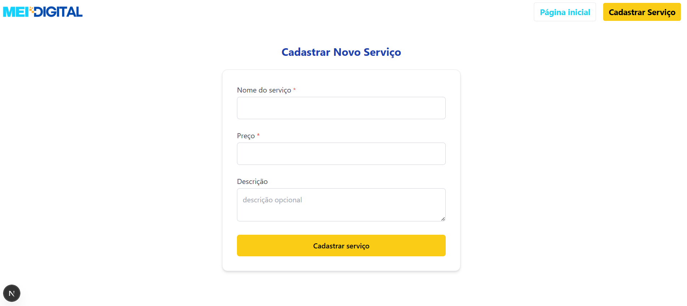

# 💼 Desafio Técnico MEI Digital - Projeto Web + Mobile

Este repositório contém os projetos Web e Mobile desenvolvidos como desafio técnico para o processo seletivo da vaga de **Desenvolvedor(a) React**.

---

## 📚 Descrição geral

Este sistema simula um catálogo de serviços para usuários web e mobile, onde é possível:

- Visualizar serviços disponíveis
- Cadastrar novos serviços (Web)
- Contratar serviços (Mobile)

O projeto foi dividido em dois subprojetos:

- `web/` → Aplicação Next.js com TypeScript e Tailwind CSS
- `mobile/` → Aplicação React Native com Expo, TypeScript e React Navigation

Ambos os projetos consomem dados do mesmo backend simulado via **JSON Server**.

---

## 🚀 Tecnologias utilizadas

| Projeto | Tecnologias principais                         |
|---------|------------------------------------------------|
| Web     | Next.js, React, TypeScript, Tailwind CSS, Axios, React Hook Form, Yup, JSON Server |
| Mobile  | React Native, Expo, TypeScript, React Navigation, React Hook Form, Yup, Axios |

---

## ⚙️ Como rodar o projeto localmente

### 1. Clonar o repositório

```
git clone https://github.com/seu-usuario/seu-repositorio.git
cd seu-repositorio
``` 

### 2. Rodar JSON Server (API fake)
```
json-server --watch db.json --port 3001
```

O arquivo db.json contém dados iniciais de serviços e contratações.
A API estará disponível em http://localhost:3001.
Se for testar o mobile em dispositivo físico, troque localhost pelo IP da sua máquina na rede local (ex: http://192.168.x.x:3001).

### 3. Rodar projeto Web (Next.js)
```
cd web
npm install
npm run dev
```

Acesse: http://localhost:3000

### 4. Rodar projeto Mobile (Expo)
```
cd mobile
npm install
npm start
```
Use o Expo Go no celular para escanear o QR Code exibido no terminal ou use um emulador.

Configure o arquivo src/services/api.ts para usar o IP correto do seu backend (se necessário).

## 📋 Checklist de funcionalidades
Web
Listagem de serviços cadastrados	✅
Listagem de serviços contratados	✅
Cadastro de novo serviço com validação	✅
Campos obrigatórios: nome e preço	✅
Campo opcional: descrição	✅
Mensagem de sucesso no cadastro	✅
Loading state na listagem	✅
Tratamento básico de erros	✅
Estilização moderna e responsiva com Tailwind	✅
Componentização com Header, Cards, Layout	✅

Mobile
Listagem de serviços disponíveis	✅
Navegação entre telas (listagem e formulário)	✅
Formulário de contratação com validação	✅
Impressão no console dos dados e serviço escolhido	✅
Feedback visual (loading no botão, mensagens)	✅
Redirecionamento após contratação	✅
Uso de React Navigation, React Hook Form e Yup	✅

## 🎁 Diferenciais implementados

- Layout customizado 
- Responsividade no Web, mobile-first
- Feedbacks de loading e mensagens de sucesso claros
- Código limpo, organizado e bem tipado com TypeScript
- Uso consistente de boas práticas de React, hooks e validação
- Navegação fluida e experiência de usuário intuitiva no app mobile

## 📄 Estrutura do projeto

.
├── db.json              # Banco fake para JSON Server
├── web/                 # Projeto Next.js (Web)
│   ├── src/
│   │   ├── pages/
│   │   ├── components/
│   │   ├── styles/
│   └── ...
├── mobile/              # Projeto React Native (Expo)
│   ├── src/
│   │   ├── components/
│   │   ├── screens/
│   │   ├── routes/
│   │   ├── services/
│   │   └── types/
│   └── App.tsx
└── README.md            # Este arquivo


## 📸 Telas 




## 🤝 Contato
Desenvolvido por Elane Alencar
[LinkedIn](https://linkedin.com/in/elanealencar/)
